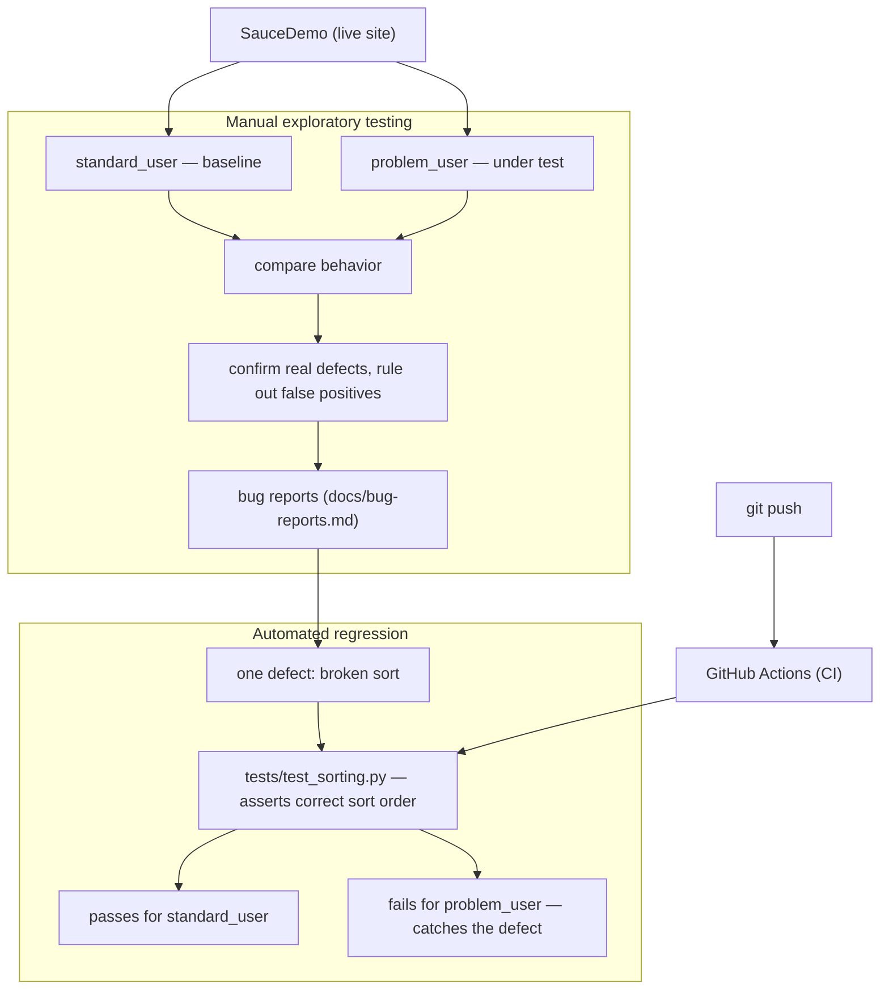

# saucedemo-qa


Manual and automated QA of [SauceDemo](https://www.saucedemo.com/), a demo e-commerce
application. This project shows the full path from **exploratory testing** to a written
**bug report** to an **automated regression test** built from that report.

## What this project demonstrates

- **Exploratory testing** of the main purchase flow (login, inventory, cart, checkout), using a reference account to establish correct behavior.
- **Professional bug reports** — documented defects with reproduction steps, expected vs. actual results, and severity ratings (see [`bug-reports.md`](bug-reports.md)).
- **Bug triage discipline** — suspected issues were validated against a known-good reference account before being reported, and false positives were ruled out instead of filed.
- **Automated regression testing** — a Playwright test that encodes correct behavior; it passes against the working account and catches a real defect when run against the broken one.

## Approach

Two SauceDemo accounts were used deliberately: `standard_user` as a **baseline** expected
to work correctly, and `problem_user` as the account **under test**. Comparing the two
made it possible to tell genuine defects apart from expected behavior — and to discard
false alarms instead of filing incorrect reports.

## How it works



## From bug report to regression test

The automated test was built directly from one of the defects found during exploratory
testing — the broken sort functionality. Here is the report it is based on:

---

**Defect — Inventory: sort dropdown options are unresponsive**

*Environment:* saucedemo.com · user: `problem_user` · Chrome

*Steps to reproduce:*
1. Log in as `problem_user` / `secret_sauce`.
2. Click the sort dropdown menu at the top right to open it.
3. Attempt to select a different sorting option (e.g., "Price (high to low)").

*Expected result:* The selected option is applied and the products are reordered based
on the new criteria.

*Actual result:* The dropdown opens, but clicking a sorting option triggers no action.
The selection is ignored and the product order does not change.

*Severity:* Medium — restricts navigation and user experience, though it does not
outright block the purchasing path.

---

From this finding, `tests/test_sorting.py` was written to encode the *correct* behavior:
after selecting "Price (low to high)", the product prices must be in ascending order.
The test passes for `standard_user` (where sorting works) and fails for `problem_user`
(where it is broken) — turning a manual observation into an automated check that catches
the defect on every run.

## Tech stack

Playwright · pytest · pytest-playwright · GitHub Actions

## Getting started

```bash
pip install -r requirements.txt
playwright install chromium
python -m pytest
```

## Project structure

```
tests/test_sorting.py   # automated regression test (Playwright + pytest)
docs/bug-reports.md     # test plan + documented defects
requirements.txt        # dependencies
.github/workflows/      # CI (runs the tests on every push)
```

## Notes

The automated tests run against the **live** SauceDemo site, so they depend on that site
being reachable and unchanged. A failure can therefore reflect an external issue (site
downtime or a change on Sauce Labs' side) rather than a problem in this repository — a
trade-off worth keeping in mind for tests that target a third-party application.
